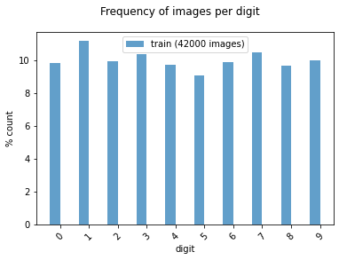
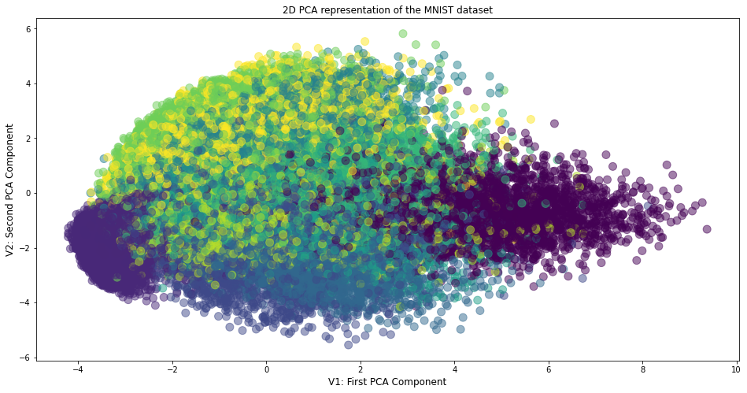

# Principal Components Analysis using MNIST Datset in Python

## 1. Objectives

The objective of this project is to demonstrate the application of the Principal Components Analysis (PCA) algorithms to represent the MNIST training data subset.

## 2.  Principal Components Analysis (PCA)

Principal Component Analysis, or PCA, is a dimensionality-reduction method that is often used to reduce the dimensionality of large data sets, by transforming a large set of variables into a smaller one that still contains most of the information in the large set.

Reducing the number of variables of a data set naturally comes at the expense of accuracy, but the trick in dimensionality reduction is to trade a little accuracy for simplicity. Because smaller data sets are easier to explore and visualize and make analyzing data much easier and faster for machine learning algorithms without extraneous variables to process.

Basically, the idea of PCA is simple: reduce the number of variables of a data set, while preserving as much information as possible. 

In this project, we shall illustrate how to compute and visualize the PCA components generated from the MINIST dataset.

## 3. Data

We shall illustrate the PCA representation of the  MNIST database of handwritten digits, available from this page, which has a training set of 42,000 examples, and a test set of 18,000 examples. We shall illustrate sample images from this data sets in the next section.

## 4. Development

Project: PCA Representation of the MNIST Dataset:
The objective of this project is to demonstrate the application of the PCA algorithm to visualize the MNIST dataset in two different ways:

* First, we apply the PCA using the Sckit-learn API
* Secondly, we implement the PCA algorithm from scratch.

* Author: Mohsen Ghazel (mghazel)
* Date: May 5th, 2021

### 4.1. Part 1: Python imports and global variables:

#### 4.1.1. Python imports:

<pre style="color:#000020;background:#e6ffff;font-size:10px;line-height:1.5;">#------------------------------------------------------
# Python imports and environment setup
#------------------------------------------------------
# opencv
import cv2
# numpy
import numpy as np
# matplotlib
import matplotlib.pyplot as plt

# import additional functionalities
from __future__ import print_function, division
from builtins import range, input

# import the PCA algorithm from sklearn
from sklearn.decomposition import PCA

# import shuffle  from sklearn
from sklearn.utils import shuffle

# import pandas
import pandas as pd

# random number generators values
# seed for reproducing the random number generation
from random import seed
# random integers: I(0,M)
from random import randint
# random standard unform: U(0,1)
from random import random
# time
import datetime
# I/O
import os
# sys
import sys

# display figure within the notebook
%matplotlib inline

#------------------------------------------------------
# Test imports and display package versions
#------------------------------------------------------
# Testing the OpenCV version
print("OpenCV : ",cv2.__version__)
# Testing the numpy version
print("Numpy : ",np.__version__)

OpenCV :  3.4.8
Numpy :  1.19.2
</pre>

#### 4.1.2. Global variables:

<pre style="color:#000020;background:#e6ffff;font-size:10px;line-height:1.5;"># set the random_state seed = 100 for reproducibilty
random_state_seed = 100

# the number of visualized images
num_visualized_images = 25
</pre>

### 4.2. Part 2: Read the input data:

* We use the MINIST dataset, which was downloaded from the following link:
  * Kaggle: Digit REcognizer: https://www.kaggle.com/c/digit-recognizer/data
  * The data files train.csv and test.csv contain gray-scale images of hand-drawn digits, from zero through nine.
  * Each image is 28 pixels in height and 28 pixels in width, for a total of 784 pixels in total. Each pixel has a single pixel-value associated with it, indicating the lightness or darkness of that pixel, with higher numbers meaning darker. This pixel-value is an integer between 0 and 255, inclusive.
  * The training data set, (train.csv), has 785 columns. The first column, called "label", is the digit that was drawn by the user. The rest of the columns contain the pixel-values of the associated image.
  * Each pixel column in the training set has a name like pixelx, where x is an integer between 0 and 783, inclusive. To locate this pixel on the image, suppose that we have decomposed x as x = i * 28 + j, where i and j are integers between 0 and 27, inclusive. Then pixelx is located on row i and column j of a 28 x 28 matrix, (indexing by zero).

#### 4.2.1. Load and normalize the training data sets:

<pre style="color:#000020;background:#e6ffff;font-size:10px;line-height:1.5;"># read the training data set
train = pd.read_csv('../large_files/train.csv').values.astype(np.float32)
# shuffle the training data set
train = shuffle(train)
# normalize the training data to [0,1]:
x_train = train[:, 1:] / 255
# format the class type to integer
y_train = train[:, 0].astype(np.int32)

#------------------------------------------------------
# Display a summary of the training data:
#------------------------------------------------------
# the number of training images
num_train_images = x_train.shape[0]
print("----------------------------------------------")
print("Training data:")
print("----------------------------------------------")
print("x_train.shape: ", x_train.shape)
print("y_train.shape: ", y_train.shape)
print("Number of training images: ", num_train_images)
print("Image size: ", x_train.shape[1:])
print("----------------------------------------------")
print("Classes/labels:")
print("----------------------------------------------")
print('The target labels: ' + str(np.unique(y_train)))
print("----------------------------------------------")

----------------------------------------------
Training data:
----------------------------------------------
x_train.shape:  (42000, 784)
y_train.shape:  (42000,)
Number of training images:  42000
Image size:  (784,)
----------------------------------------------
Classes/labels:
----------------------------------------------
The target labels: [0 1 2 3 4 5 6 7 8 9]
----------------------------------------------
</pre>

#### 4.2.2. Visualize some of the training images and their associated targets:

##### 4.2.2.1. First implement a visualization functionality to visualize the number of randomly selected images:

<pre style="color:#000020;background:#e6ffff;font-size:10px;line-height:1.5;">"""
# A utility function to visualize multiple images:
"""
def visualize_images_and_labels(num_visualized_images = 25, dataset_flag = 1):
  """To visualize images.

&nbsp;&nbsp;&nbsp;&nbsp;&nbsp;&nbsp;Keyword arguments:
&nbsp;&nbsp;&nbsp;&nbsp;&nbsp;&nbsp;&nbsp;&nbsp;&nbsp;- num_visualized_images -- the number of visualized images (deafult 25)
&nbsp;&nbsp;&nbsp;&nbsp;&nbsp;&nbsp;&nbsp;&nbsp;&nbsp;- dataset_flag -- 1: training dataset, 2: test dataset
&nbsp;&nbsp;&nbsp;&nbsp;&nbsp;&nbsp;Return:
&nbsp;&nbsp;&nbsp;&nbsp;&nbsp;&nbsp;&nbsp;&nbsp;&nbsp;- None
&nbsp;&nbsp;"""
  #--------------------------------------------
  # the suplot grid shape:
  #--------------------------------------------
  num_rows = 5
  # the number of columns
  num_cols = num_visualized_images // num_rows
  # setup the subplots axes
  fig, axes = plt.subplots(nrows=num_rows, ncols=num_cols, figsize=(8, 10))
  # set a seed random number generator for reproducible results
  seed(random_state_seed)
  # iterate over the sub-plots
  for row in range(num_rows):
      for col in range(num_cols):
        # get the next figure axis
        ax = axes[row, col];
        # turn-off subplot axis
        ax.set_axis_off()
        #--------------------------------------------
        # if the dataset_flag = 1: Training data set
        #--------------------------------------------
        if ( dataset_flag == 1 ): 
          # generate a random image counter
          counter = randint(0,num_train_images)
          # get the training image
          image = np.squeeze(x_train[counter,:])
          # get the target associated with the image
          label = y_train[counter]
        #--------------------------------------------
        # dataset_flag = 2: Test data set
        #--------------------------------------------
        else: 
          # generate a random image counter
          counter = randint(0,num_test_images)
          # get the test image
          image = np.squeeze(x_test[counter,:])
          # get the target associated with the image
          label = y_test[counter]
        #--------------------------------------------
        # display the image
        #--------------------------------------------
        ax.imshow(image.reshape(28,28), cmap=plt.cm.gray_r, interpolation='nearest')
        # set the title showing the image label
        ax.set_title('y =' + str(label), size = 8)
</pre>

##### 4.2.2.2. Call the function to visualize the randomly selected training images:

<pre style="color:#000020;background:#e6ffff;font-size:10px;line-height:1.5;"># the number of selected training images
num_visualized_images = 25
# call the function to visualize the training images
visualize_images_and_labels(num_visualized_images, 1)
</pre>

#### 4.2.3. Examine the number of images for each class of the training and testing subsets:

<pre style="color:#000020;background:#e6ffff;font-size:10px;line-height:1.5;"># create a histogram of the number of images in each class/digit:
def plot_bar(y, loc='left', relative=True):
    width = 0.35
    if loc == 'left':
        n = -0.5
    elif loc == 'right':
        n = 0.5
     
    # calculate counts per type and sort, to ensure their order
    unique, counts = np.unique(y, return_counts=True)
    sorted_index = np.argsort(unique)
    unique = unique[sorted_index]
     
    if relative:
        # plot as a percentage
        counts = 100*counts[sorted_index]/len(y)
        ylabel_text = '% count'
    else:
        # plot counts
        counts = counts[sorted_index]
        ylabel_text = 'count'
         
    xtemp = np.arange(len(unique))
    plt.bar(xtemp + n*width, counts, align='center', alpha=.7, width=width)
    plt.xticks(xtemp, unique, rotation=45)
    plt.xlabel('digit')
    plt.ylabel(ylabel_text)
 
plt.suptitle('Frequency of images per digit')
plot_bar(y_train, loc='left')
plt.legend([
    'train ({0} images)'.format(len(y_train))
]);
</pre>

### 4.3. Part 3: Use Scikit-learn-API: Generate the PCA representation of the training data:

#### 4.3.1. Visualize the 2D PCA representation of the training data

<pre style="color:#000020;background:#e6ffff;font-size:10px;line-height:1.5;">#----------------------------------------
# Step 3.1.1: Compute the PCA components
#----------------------------------------
# Instantiante the PCA() algorithm
pca = PCA()
# apply the PCA on the training data
reduced = pca.fit_transform(x_train)
#----------------------------------------
# Step 3.1.2: plot the first 2 PCA 
#             components
#----------------------------------------
# create a figure and set its axis
fig_size = (16,8)
# create the figure 
plt.figure(figsize=fig_size)
# plot the first 2 PCA components
plt.scatter(reduced[:,0], reduced[:,1], s=100, c=y_train, alpha=0.5)
# set the x-label
plt.xlabel('V1: First PCA Component', fontsize = 12)
# set the y-label
plt.ylabel('V2: Second PCA Component', fontsize = 12)
# set the title
plt.title('2D PCA representation of the MNIST dataset', fontsize = 12)
# show the figure
plt.show()
</pre>

#### 4.3.2. Display the explained variance variations:

<pre style="color:#000020;background:#e6ffff;font-size:10px;line-height:1.5;">#----------------------------------------
# Step 3.2.1: plot the explained variance for 
#             each PCA component:
#----------------------------------------
# create a figure and set its axis
fig_size = (16,5)
# create the figure 
plt.figure(figsize=fig_size);
# the first subplot
plt.subplot(121)
# plot the the explained variance for each PCA component
plt.plot(pca.explained_variance_ratio_)
# the x-label
plt.xlabel('PCA Dimensions', fontsize = 10)
# the y-label
plt.ylabel('Explained Variance (Percent)', fontsize = 12)
# the figure title
plt.title('Explained variance of each PCA component', fontsize = 12)

#----------------------------------------
# Step 3.2.2: plot the cumulative explained 
#            variance of the PCA components
#----------------------------------------
# cumulative variance
# choose k = number of dimensions that gives us 95-99% variance
cumulative = []
last = 0
# sum-up the expplained variances for each component
# to comute the cumulative explained variance
for v in pca.explained_variance_ratio_:
    # sum the explained variance
    cumulative.append(last + v)
    # store the last comulative variance
    last = cumulative[-1]
# the second subplot
plt.subplot(122)
# display the cumulative variance
plt.plot(cumulative)
# the x-label
plt.xlabel('PCA Dimensions', fontsize = 12)
# the y-label
plt.ylabel('Cumulative explained variance (percent)', fontsize = 12)
# the figure title
plt.title('Cumulative explained variance vs the PCA dimensions', fontsize = 12)
# show the figure
plt.show()
</pre>

### 4.4. Part 4: From Scratch: Generate the PCA representation of the training data:

#### 4.1.1. Visualize the 2D PCA representation of the training data:

<pre style="color:#000020;background:#e6ffff;font-size:10px;line-height:1.5;">#----------------------------------------
# Step 4.1.1: Compute the PCA components
#----------------------------------------
# decompose covariance
covX = np.cov(x_train.T)
# compute the eigen-values and vectors of covX
lambdas, Q = np.linalg.eigh(covX)

# lambdas are sorted from smallest --&gt; largest
# some may be slightly negative due to precision
idx = np.argsort(-lambdas)
# sort in proper order
lambdas = lambdas[idx] 
# get rid of negatives
lambdas = np.maximum(lambdas, 0) 
Q = Q[:,idx]
# compute the transformed data
Z = x_train.dot(Q)
#----------------------------------------
# Step 4.1.2: plot the first 2 PCA components
#----------------------------------------
# create a figure and set its axis
fig_size = (16,8)
# create the figure 
plt.figure(figsize=fig_size)
# plot the first 2 PCA components
plt.scatter(Z[:,0], Z[:,1], s=100, c=y_train, alpha=0.3)
# set the x-label
plt.xlabel('V1: First PCA Component', fontsize = 12)
# set the y-label
plt.ylabel('V2: Second PCA Component', fontsize = 12)
# set the title
plt.title('2D PCA representation of the MNIST dataset', fontsize = 12);
# shoe the figure
plt.show()
</pre>

#### 4.4.2. Display the explained variance variations:

<pre style="color:#000020;background:#e6ffff;font-size:10px;line-height:1.5;">#----------------------------------------
# Step 4.2.1: plot the explained variance for 
#             each PCA component:
#----------------------------------------
# create a figure and set its axis
fig_size = (16,16)
# create the figure 
plt.figure(figsize=fig_size);
# the first subplot
plt.subplot(211)
# plot the the explained variance for each PCA component
plt.plot(lambdas)
# the x-label
plt.xlabel('PCA Dimensions', fontsize = 10)
# the y-label
plt.ylabel('Explained variance (percent)', fontsize = 12)
# the figure title
plt.title('Explained variance of each PCA component', fontsize = 12)

#----------------------------------------
# Step 4.2.2: plot the cumulative explained 
#            variance of the PCA components
#----------------------------------------
# the second subplot
plt.subplot(212)
# display the cumulative variance
plt.plot(np.cumsum(lambdas))
# the x-label
plt.xlabel('PCA Dimensions', fontsize = 12)
# the y-label
plt.ylabel('Cumulative explained variance (Percent)', fontsize = 12)
# the figure title
plt.title('Cumulative explained variance vs. the PCA dimensions', fontsize = 12)
# show the figure
plt.show()
</pre>

### 4.5. Step 5: Display a successful execution message:

<pre style="color:#000020;background:#e6ffff;font-size:10px;line-height:1.5;"># display a final message
# current time
now = datetime.datetime.now()
# display a message
print('Program executed successfully on: '+ str(now.strftime("%Y-%m-%d %H:%M:%S") + "...Goodbye!\n"))

Program executed successfully on: 2021-05-09 15:38:04...Goodbye!
</pre>

## 5. Analysis

* In view of the presented results, we make the following observations:

  * The PCA representations of the MNIST training data sets generated using the following methods are comparable:
  * The PCA computed using the Scikit-learn API.
  * The PCA computed from scratch using the Eigen decomposition of the covariance matrix of the training data 784 features vectors
  * The slight differences can be explained as follows:
  * For PCA implementation, the orientations of the PCA 2D representation is flipped in the first PCA direction due to the fact that the eigenvector is not unique, as both V1 and -V1 are acceptable values
  * For both methods, the explained variance variance by each component decays rapidly, indicating that the first few PCA components capture most of the data variability
  * Similarly, the cumulative explained variance confirming that most of  most of the data variability lies in the first few PCA components
  * The differences in the vertical axes scaling of the variance explanation figures generated by the 2 methods are due to:
    * The PCA computed using the Scikit-learn API uses percentage scaling
    * The PCA computed from scratch using the Eigen decomposition of the covariance matrix of the training data 784 features vectors, as use frequency scaling.

## 6. Future Work

* We plan to explore the following related issues:

  * To truncate the PCA decomposition space of the MNIST dataset to K dimension, K < 784, by removing insignificant dimension, after capturing 95% of the variability
  * To classify the MNIST dataset using the K-dimensional PCA decomposition space 
  * To assess the computational complexity vs accuracy trade-off of classifying the MNIST dataset using:
  * The original training dataset
  * The reduced PCA representation.

## 7. References

1. Kaggle. Digit Recognizer: Learn computer vision fundamentals with the famous MNIST data. https://www.kaggle.com/c/digit-recognizer/data 
2. Yann LeCun et. al. THE MNIST DATABASE of handwritten digits. http://yann.lecun.com/exdb/mnist/ buitin. (May 9th, 2021). A STEP-BY-STEP EXPLANATION OF PRINCIPAL COMPONENT ANALYSIS (PCA). https://builtin.com/data-science/step-step-explanation-principal-component-analysis 
3. PennState Eberly College of Science. Principal Components Analysis (PCA). https://online.stat.psu.edu/stat505/book/export/html/670 
4. Aditya Sharma. Principal Component Analysis (PCA) in Python. https://www.datacamp.com/community/tutorials/principal-component-analysis-in-python 
5. Python Data Science Handbook. In Depth: Principal Component Analysis. https://jakevdp.github.io/PythonDataScienceHandbook/05.09-principal-component-analysis.html 
6. Towards data science. PCA using Python (scikit-learn). https://towardsdatascience.com/pca-using-python-scikit-learn-e653f8989e60 
7. Usman Malik. Implementing PCA in Python with Scikit-Learn. https://stackabuse.com/implementing-pca-in-python-with-scikit-learn/ 
8. Towards AI Team. Principal Component Analysis (PCA) with Python Examples  - Tutorial. https://pub.towardsai.net/principal-component-analysis-pca-with-python-examples-tutorial-67a917bae9aa
 
 
